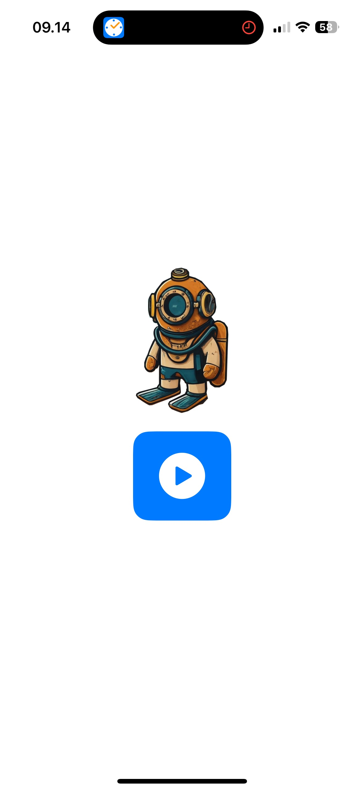
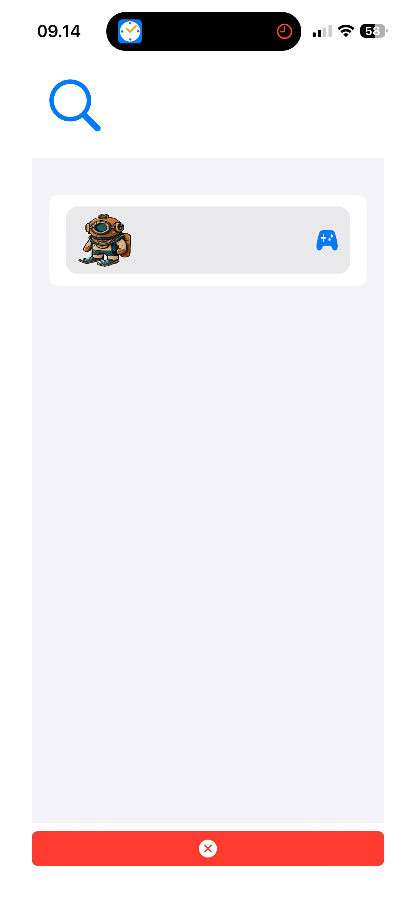

# DeepDive - Multiplayer
The second version of DeepDive iOS game aims to deliver an engaging multiplayer experience, enabling users to play with their friends in real-time. This version, developed using SpriteKit and multipeer connection, incorporates significant improvements and new features based on user feedback and technological advancements. The primary focus is on real-time synchronization of character movements between two devices, ensuring a  responsive gameplay experience. By leveraging advanced technologies, DeepDive offers a seamless and immersive gaming experience, allowing players to connect and compete with friends effortlessly

## Technologies Used

- **Spritekit:** For rendering 2D graphicss
- **Multipeer Connection:** For handling connection between 2 devices
- **SwiftUI:** For building the user interface with a declarative Swift syntax

## Screenshots

<div style="display: flex; overflow-x: auto; gap: 50px;">
  
  
</div>

## Video
<a href="https://youtube.com/shorts/6wNOgE8Jfxs?feature=share" target="_blank">
  Click me to view the app demo
</a>

## Features

- Fun and unique gameplay
- Play with friends in real-time

## Installation

To install and run this app on your iOS Phone, follow these steps:

1. Clone the repository
    ```bash
    git clone https://github.com/KetsunoAna117/DeepDive-Multiplayer.git
    ```
2. Open the project in Xcode
3. Connect your iOS and select it as the run destination
4. Build and run the project

## Usage

1. Launch the app on your iOS Phone
2. Pair to another device 
3. Tilt your phone up, down, left, right to move

### Game Information
-  Beware of oxygen (top right corner), if it depleted, you'll be teleported back to the starting point
-  The deeper you go, the faster your oxygen will run out
-  Try to evade sharks and bomb because it will also decrease your oxygen level
-  The player who touches the portal first will win

## Authors

- [@Hans Arthur Cupiterson](https://www.github.com/KetsunoAna117)
- [@Muhammad Rasyad Caesarardhi](https://github.com/mrasyadc)
- [@Andrew Oroh](https://github.com/Andreworoh27)

## Contributing

Contributions are welcome! Please fork the repository and create a pull request with your changes.

## Feedback

If you have any feedback, please open a new Issue
